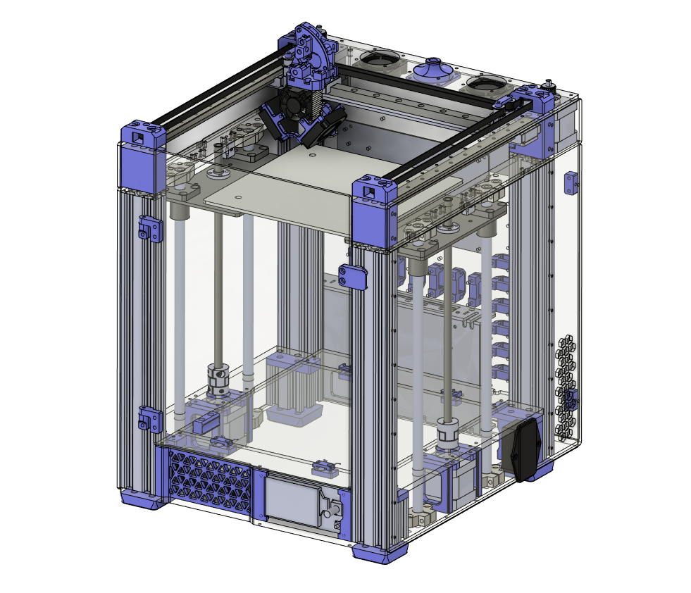

# GBot-Litchi-Mark-II

Продолжение линейки Litchi – Litchi Mark II. 

[3D-моделька, чтобы покрутить.](https://myhub.autodesk360.com/ue2ddbd59/g/shares/SH286ddQT78850c0d8a4284d03fa6811be10?mode=embed)

## Особенности и характеристики:

- Поле 180х180х180 мм
- Габариты 340х306х420 мм
- Кинематика HBot (в перспективе CoreXY)
- Подача direct (аналог Sailfin)
- Перемещение XY – рельсы
- Перемещение Z – валы
- Датчики Холла в качестве концевиков
- Два отсека электроники: подвал/рюкзак
- Доступ к подвалу не требует переворачивания принтера
- Охлаждение рюкзака (заднего отсека) пассивное + активное
- Dual Z выравнивание сторон по концевикам
- Автокалибровка стола датчиком Beacon (карта высот)

## Корпус

Основан на констуркционном профиле 2040. Кинематика расположена на 6мм акриле, обшивка 3мм. Есть возможность установки купола, т.е. полностью закрытый корпус – пассивную термокамеру (в разработке).

## Метизы
- м6х30    8шт снизу в ножки в профиль.
- м6х18    8шт снизу в ножки в маленькие огрызки профиля\печатные детали.
- м6х90\95    8шт сверху в крепления шкивов, 90мм при верхнем портале 6мм и 95мм при верхнем портале 8мм.
- м3х10    20шт для крепления нижних правой и левой панели.
- м3х10    8шт для крепления верхних правой и левой панели.
- м3х10    14шт для крепления передней печатной панели и акриловой детали над ней и печатных деталей к ней.
- м3х10    8шт для крепления акриловой панели внутри принтера у задней стенки и крепления к ней печатных деталей для акрилового капота.
- м3х16    8шт для крепления моторов по Z.
- м3х65\70    4шт для крепления стоек рядом с моторами Z, либо переделать детали под вплавляемые гайки. Как вариант вкрутить в пластик или использовать саморезы.
- м3х10    8шт для крепления моторов на верхний портал.
- м3х20    6шт для крепления шкивов в печатных деталях по углам.
- м3х12    20шт для крепления рельс по Y.
- м3х8\10    9шт для крепления рельсы по Х, винты с длинной 10мм выглядят более надежно ибо "мяса в рельсе 3.5мм и 3мм балка Х.
- м3х8\10    4шт для крепления головы к рельсе Х при толщине верхнего портала 6мм. Толщина кронштейна в месте крепления 6мм и глубина резьбы в каретке 3.5мм, лучше взять винты длиной 10мм и проложить шайбы.
- м3х10\12    4шт для крепления головы к рельсе Х при верхрем портале в 8мм. Толщина кронштейна в месте крепления 8мм и глубина резьбы в каретке 3.5мм, лучше взять винты длиной 12мм и проложить шайбы.
- м3х6    8шт для крепления балки Х к кареткам рельс Y.
- м3х20    3шт для крепления вентилятора обдува драйверов.
- м5х16\20    16шт для крепления держателей валов оси Z. Длина 16мм для держателей валов с "тонкими ушами" в 5мм, для держаталей с толстыми ушами 20мм.

- Осторожно могут быть ошибки, просьба сверяться с 3д моделью. Позже допишу.
